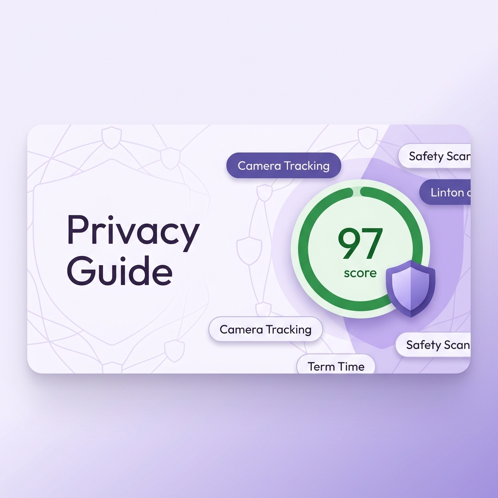
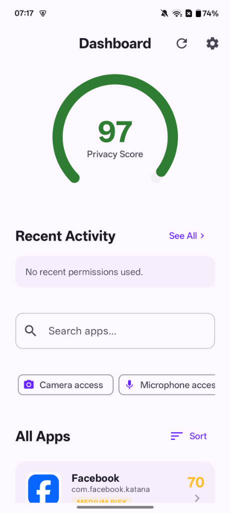
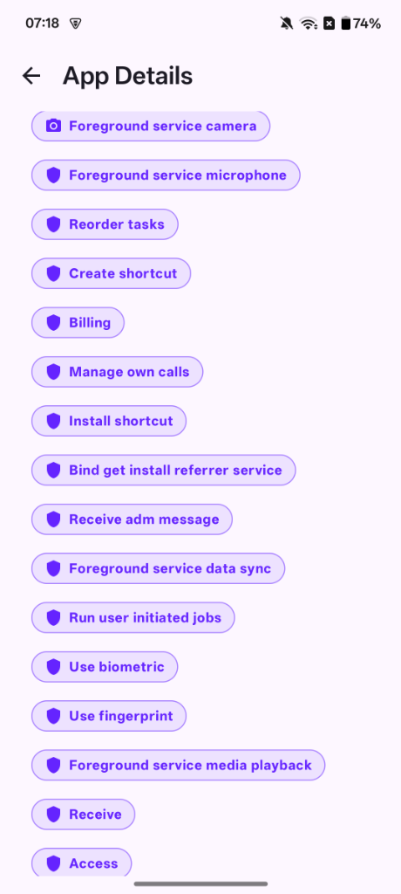
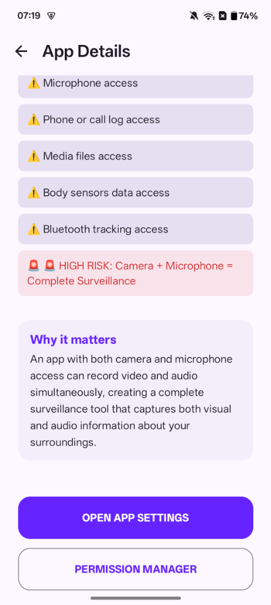
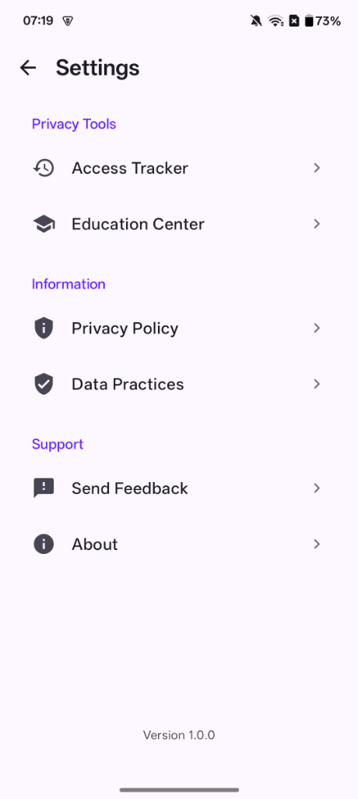
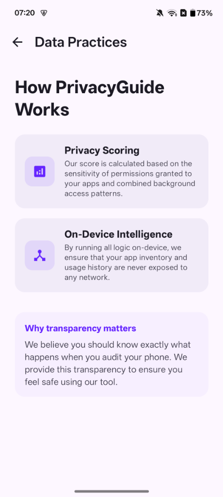

# Privacy Guide

  
  <h3>Your Personal Android Privacy Assistant</h3>
  
Transparency. Education. Control.

---

## Overview

**Privacy Guide** is an Android privacy assistant designed to help users take back control of their data. It audits installed applications for sensitive permission usage, detects risky permission combinations, and provides plain-language explanations of why certain accesses matter.

This repository (`PrivacyGuide-Docs`) houses the public-facing documentation, store listing details, and compliance certifications for the Privacy Guide application.

## Key Features

- **🛡️ Privacy Audit Dashboard**: A bird's-eye view of your device's privacy health.
- **📊 Priority Scoring**: Automated risk assessment based on granted permissions.
- **🧠 Risk Heuristics**: Detection of dangerous combinations like (Camera + Microphone) or (Location + Camera).
- **🕰️ Access Tracker**: Real-time logging of permission access events.
- **📚 Education Center**: 15+ interactive guides explaining Android's data safety labels.

## App Screenshots

<table align="center">
  <tr>
    <td align="center"> Dashboard</td>
    <td align="center"> App Audit</td>
    <td align="center"> Risk Insights</td>
  </tr>
  <tr>
    <td align="center"> Settings</td>
    <td align="center"> Data Practices</td>
  </tr>
</table>

## Documentation

- [**Privacy Policy**](PRIVACY_POLICY.md)
- [**Data Safety Declaration**](DATA_SAFETY.md)
- [**Security Policy**](SECURITY.md)
- [**Contact & Support**](CONTACT.md)

## Development Status

The Privacy Guide app is currently in stable release development. 

## Contact

For support or business inquiries, reach out to us at:
📧 [vijaytank132@gmail.com](mailto:vijaytank132@gmail.com)

---
© 2026 Vijay Tank. All rights reserved.
